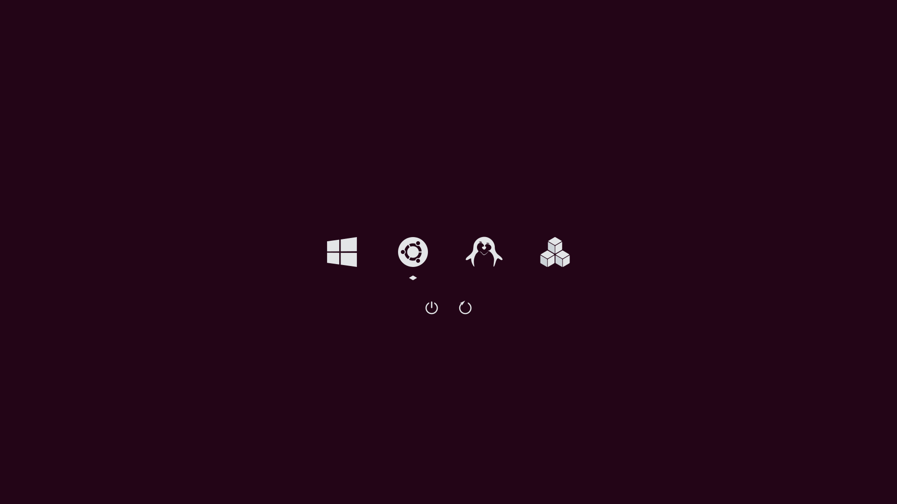

# darkmini

Dark theme for rEFInd

[rEFInd](http://www.rodsbooks.com/refind/) is a simplistic boot manager for UEFI
based systems. This is a clean, dark and minimal theme for it.

### Usage

 1. Locate your refind EFI directory. This is commonly `/boot/efi/EFI/refind`
    though it will depend on where you mount your ESP and where rEFInd is
    installed. `fdisk -l` and `mount` may help.

 2. Create a folder called `themes` inside it, if it doesn't already exist

 3. Clone this repository into the `themes` directory.

 4. To enable the theme add `include themes/darkmini/theme-mini.conf` at the end of refind.conf or add `include themes/darkmini/theme.conf`
 5. Set option `banner` in theme file for select background image
    Ex: `banner themes/darkmini/bg/ubuntu_style.png  `
    
## theme-mini

background.png

background2.png

ubuntu_style.png

ubuntu_two.png

## theme

